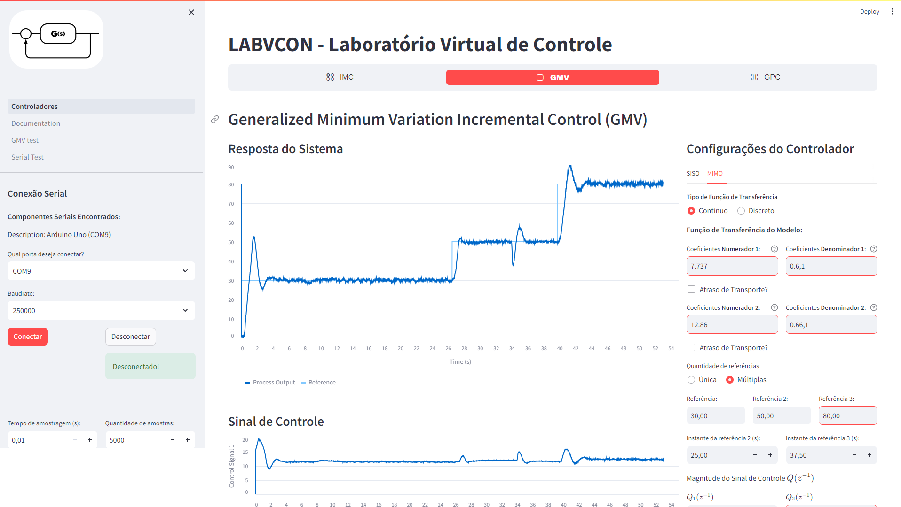

# Projeto LABVCON v2.0

## Descrição

LABVCON v2.0 é uma interface de controle de protótipos de sistemas dinâmicos implementados em Arduino em tempo real. Com ela se pode implementar os controladores **PID**, **IMC** (Internal Model Control), **GMV** (Generalized Minimum Variance) e **GPC** (Generalized Predictive Control) em sistemas SISO (Single Input Single Output). 

O usuário insere o modelo do sistema e o tempo de amostragem, implementa os controladores no sistema e consegue receber os gráficos de resposta, do sinal de controle e índices de Métricas **IAE** e **TVC** para comparar os resultados.

## Instalação

Para instalar e começar a usar o LABVCON v2.0, siga estas etapas simples:

1. **Clone o repositório para sua máquina local:**
   ```bash
   git clone https://github.com/jrneliodias/tcc-prtotipo-python
    ```

2. **Crie um ambiente virtual (opcional, mas recomendado):**
    ```bash
    python -m venv venv
    ```
3. **Ative o ambiente virtual:**
    - No Windows:
     ```bash
    venv\Scripts\activate
    ```
    - No Linux/Mac:
     ```bash
    source venv/bin/activate
    ```

4. **Instale as dependências do projeto:**
    ```bash
    pip install -r requirements.txt
    ```

5. **Execute o servidor Streamlit do projeto:**
    ```bash
    streamlit run LABVCON.py
    ```

## Imagens da Interface

### LABVCON modo light


### LABVCON modo dark


